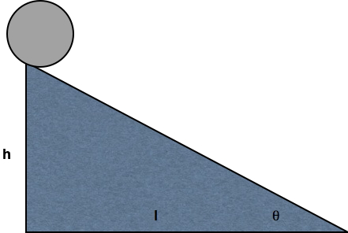
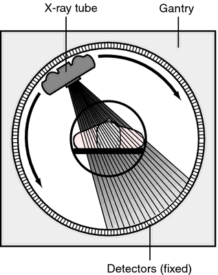

## Prelude

> "If understanding everything we need to know about the brain is a mile, how far have we walked?"

---

<iframe width="560" height="315" src="https://www.youtube.com/embed/nvXuq9jRWKE" frameborder="0" allow="autoplay; encrypted-media" allowfullscreen></iframe>

## PSY 511 {.flexbox .vcenter}

### Foundations of Cognitive and Affective Neuroscience

Rick O. Gilmore, Ph.D. 
Associate Professor of Psychology

## Today's topics

- Why neuroscience is harder than physics
- Course overview
- Methods in neuroscience

# Why neuroscience is harder than physics

---

---

## What do we need to know to answer the question?

- What is the state...
    - Of the world
    - Of the organism
        - Body
        - Brain/mind
- Some states more easily measured than others

## Brain & behavior are complex, dynamic *systems* with

- Components
- Interactions
- Forces/influences
- Boundaries
- Inputs/outputs/processes

## Systems...

- "Behave" or change state across time
- Return to starting state
- Appear to be regulated, controlled, influenced by feedback loops

## May be thought of as [networks](https://en.wikipedia.org/wiki/Network_science)

---

## Studying systems is hard because...

- Single parts -> multiple functions
- Single functions -> multiple parts
- Change structure/function over time
    - Examples?
- Biological systems not "designed" like human-engineered ones
- Measuring what is being exchanged? What is being controlled? 

# Course overview

## Goals

- Master fundamentals of neuroscientific concepts and facts
- Prepare to read primary source literature in behavioral, cognitive, affective, and clinical neuroscience

## Structure

<https://psu-psychology.github.io/psy-511-scan-fdns-2018>

## Questions

- What is the basic plan of the nervous system?
- How do neurons work?
- How do neurons connected in networks achieve behavioral goals?
- How does the nervous system develop? How has it evolved?

## Approach

### Brain architecture (neuroanatomy)
### Brain function (neurophysiology)
### Brain communication (neurochemistry)
### Changes over evolutionary and developmental time

## Approach

- The nervous system as information processing system
- **Inputs**
    - From environment, body, brain
- **Processing**
    - Current inputs + brain state + body state + possible future states...
    - Stored information
    - Physiological & behavioral goals

---

- **Outputs**
    - To brain, body, environment
  
## Cajal/Swanson Architecture {.flexbox .vcenter}

---

[Swanson, 2005](http://dx.doi.org/10.1002/cne.20733)

---

[Swanson, 2005](http://dx.doi.org/10.1002/cne.20733)

## Why neuroscience needs behavior

[[@Krakauer2017-xl]](http://dx.doi.org/10.1016/j.neuron.2016.12.041)

---

[[@Krakauer2017-xl]](http://dx.doi.org/10.1016/j.neuron.2016.12.041)

# Neuroscience methods

## Evaluating methods 

### What is the question?

- Structure X -> Structure Y
- Structure X -> Function Y

### What are we measuring?

- Structure
- Activity
    - Why not *function*?

## Evaluating methods

### Strengths & Weaknesses

- Cost
- Invasiveness
- Spatial/temporal resolution

## Spatial resolution {.flexbox .vcenter}

<http://ai.ato.ms/MITECS/Images/churchland.figure1.gif>

## ...and Temporal Resolution

[[@sejnowski2014putting]](http://doi.org/10.1038/nn.3839)

## Types of methods

### Structural 

- Anatomy
- Connectivity/connectome

### Functional (next time)

- What does it do?
- Physiology/Activity

## Mapping structures

- Cell/axon stains
- **Golgi stain** -- whole cells
- Cellular distribution, concentration, microanatomy

---

<http://connectomethebook.com/wp-content/uploads/2011/11/Brainforest17_1119.jpg>

---

Here's a pretty one of the hippocampus.

---

<http://wam.umn.edu/calendar/cajal/>

And here is one from Santiago Ramon y Cajal.

## [Camillo Golgi](https://en.wikipedia.org/wiki/Camillo_Golgi)

## Nissl stain

Here's a Nissl-stained section of the macaque brain. It stains only cell bodies, but the density of staining tells us where there are lots of cells and where there are fewer.

## [Franz Nissl](https://en.wikipedia.org/wiki/Franz_Nissl)

## [Brainbow](http://cbs.fas.harvard.edu/science/connectome-project/brainbow)

[[@lichtman_technicolour_2008]](http://doi.org/10.1038/nrn2391)

## Brainbow

[[@lichtman_technicolour_2008]](http://doi.org/10.1038/nrn2391)

## [Clarity](http://clarityresourcecenter.com/CLARITY.html)

<iframe width="560" height="315" src="https://www.youtube.com/embed/c-NMfp13Uug" frameborder="0" allowfullscreen></iframe>

## Evaluating cellular tracing techniques

- Invasive (in humans post-mortem only)
- High spatial resolution, but poor/coarse temporal
    - Why?

## Mapping structures

- Computed axial tomography (CAT), CT
- X-ray based

---

<http://img.tfd.com/mk/T/X2604-T-22.png>

## Tomography {.flexbox .vcenter}

<http://static.howstuffworks.com/gif/cat-scan-pineapple.jpg>

---

Here's a CT image of two brains, the one on the right has an intracerebral hemorrhage.

## Magnetic Resonance Imaging

- Magnetic resonance a property of some isotopes and complex molecules
- In magnetic field, absorb and release radio frequency energy
- Hydrogen, common in water & fat, is one
- Aligns with strong magnetic field
- When perturbed, speed of realignment varies by tissue
- Realignment gives off radio frequency (RF) signals
- Strength of RF ~ density

## MRI {.flexbox .vcenter}

<http://s.hswstatic.com/gif/mri-steps.jpg>

## Structural MRI

- Tissue density/type differences
- Gray vs. white - Axon fibers
- Spectroscopy
- Region sizes/volumes

---

Here is an illustration of the different slices of an image sequence.

---

Here's an illustration of how different RF pulse sequences and decoding schemes can reveal different patterns of structure.

---

Here's an example of MR spectroscopy showing the concentrations of several different metabolites in a large voxel of brain tissue.

## Voxel-based morphometry (VBM)

Volume differences in schizophrenic patients vs. controls

[@Pomarol-Clotet2010-tq]

And here's an illustration of the use of morphometric techniques. The colored portions are statistical maps placed on top of a base structural map. The statistical maps provide information about the comparison in brain volumes between patients and controls in those areas.

## What is the wiring diagram ("connectome")?

The idea is analogous to electronics. We want the schematic. Without the schematic, we can't really tell what the thing does.

---

## Retrograde (output -> input) vs. anterograde (input -> output) tracers

<http://openi.nlm.nih.gov/imgs/512/348/3176268/3176268_1471-2105-12-351-2.png>

---

<iframe width="560" height="315" src="https://www.youtube.com/embed/nvXuq9jRWKE" frameborder="0" allowfullscreen></iframe>

## Diffusion Tensor Imaging (DTI)

- Structural MRI technique
- Diffusion tensor: measurement of spatial pattern of $H_2O$ diffusion in small volume
- Uniform ("isotropic") vs. non-uniform ("anisotropic")
- Strong anisotropy suggests large # of axons with similar orientations (fiber tracts)

---

Here's an illustration of what a tensor looks like. You can see an isotropic and an anisotropic tensor.

---

And here's how we go from a tensor to estimating the pathway of a fiber tract.

---

## Connectome as matrix

---

## Main points

- Psychology is harder than physics
- Understanding brain/behavior relations requires a diverse toolkit

## Your turn

1. Pick two papers you want to read and (better) understand
    - Email me APA formatted citation (with DOIs)
    - Indicate three concepts/terms you are especially interested in understanding
2. Choose a behavior or mental state you want to (better) understand
    - Take an information processing perspective and briefly sketch out (in no more than a short paragraph) the main inputs, outputs, and computations involved.
    - When thinking about *outputs* make sure to distinguish between *behaviors* (e.g., movements, facial expressions, vocalizations) and *physiological states* (e.g., changes in heart rate, hormone concentrations in the blood, etc.)

## References {.smaller}
