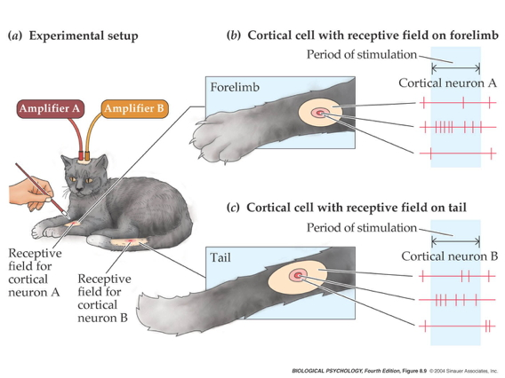
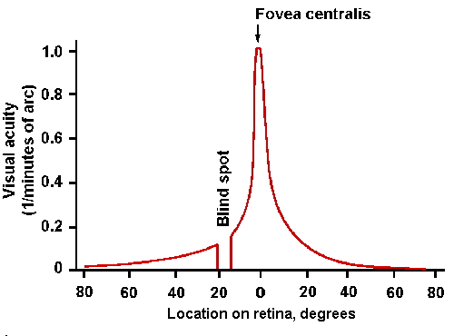
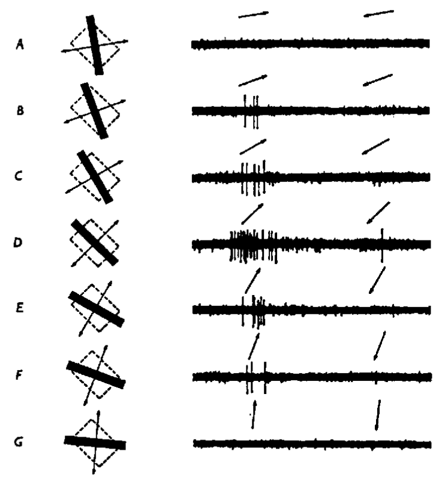

```{r setup, include=FALSE}
knitr::opts_chunk$set(echo = FALSE)
```

## Prelude

<iframe width="560" height="315" src="https://www.youtube.com/embed/FscIgtDJFXg" frameborder="0" allowfullscreen></iframe>

<div class="centered">
I can see clearly now.
</div>

## Today's topics

- Common principles in sensation & perception
- Case study: Vision

---

<div class="centered">

</div>

## Basic questions

- Exteroception
- Interoception
- Response: What should I do about it?

---

<div class="centered">

</div>

<!-- --- -->

<!-- <div class="centered"> -->
<!--  -->
<!-- </div> -->

<!-- ## Systems/information processing view -->

<!-- - Input -->
<!-- - Processing -->
<!-- - Memory -->
<!-- - Output -->

<!-- <div class="notes"> -->
<!-- As we started doing when we talked about emotion, we'll take a systems or information processing approach. What's the input, how is it processed, what role might stored information or memory play, and then what is the output? -->
<!-- </div> -->

<!-- ## You vs. Your Smartphone -->

<!-- <div class="centered"> -->
<!--  -->
<!-- </div> -->

<!-- <div class="notes"> -->
<!-- I find that most of us aren't used to thinking about how our senses work using this framework, so I want to try to use a metaphor...the smartphone. Have you ever thought about how you and your smartphone are alike? -->
<!-- </div> -->

<!-- ## Multisensory processing in a smartphone -->

<!-- - Accelerometer -->
<!-- - Gyroscope -->
<!-- - Magnetometer -->
<!-- - Proximity sensor -->
<!-- - Ambient light sensor -->
<!-- - Barometer -->

<!-- <http://www.phonearena.com/news/Did-you-know-how-many-different-kinds-of-sensors-go-inside-a-smartphone_id57885> -->

<!-- <div class="notes"> -->
<!-- Like you, your smartphone has multiple sensors that provide it information. -->
<!-- </div> -->

<!-- ## Multisensory processing in a smartphone -->

<!-- - Thermometer -->
<!-- - Mic -->
<!-- - Camera -->
<!-- - Radios (Bluetooth, wifi, cellular, GPS) -->

<!-- <http://www.phonearena.com/news/Did-you-know-how-many-different-kinds-of-sensors-go-inside-a-smartphone_id57885> -->

<!-- <div class="notes"> -->
<!-- We'll come back to this metaphor when we talk about action planning. For now, we'll switch back to talking about our own nervous systems. -->
<!-- </div> -->

<!-- ## Dimensions of sensory processing -->

<!-- - *Interoceptive* -->
<!--     + How am I? -->
<!-- - *Exteroceptive* -->
<!--     + What's in the world, where is it? -->

<!-- <div class="notes"> -->
<!-- Some of your smartphone sensors provide information about the phone's status -- its temperature, position/movement, etc. -- in our case, we call sensory systems that provide information about internal status *interoceptive*. These contrast with the systems that provide information about what's out there in the world. -->
<!-- </div> -->
    
## Questions for interoception

- Tired or rested?
- Well or ill?
- Hungry or thirsty or sated?
- Stressed vs. coping?
- Emotional state?

<div class="notes">
What kinds of information do you think your interoceptive systems provide? What kinds of questions do these sensors help the nervous system to answer?
</div>

## Questions for exteroception

- Who/What is out there?
- Where is it?

## Who/what

>- Animate/inanimate?
>- Conspecific (same species)/non?
>- Threat/non?
>- Familiar/un?
>- Mate/non? or Friend/not?
>- Food source/non?

<div class="notes">
Let's focus on the first question -- who or what is out there. What kinds of questions would a useful exteroceptive system provide information about?
</div>

## Where

- Distance
    - Proximal
    - Distal
- Elevation, azimuth
- Coordinate frames
    + Self/ego (left of me)
    + Object (top of object)
    + Allo/world (North of College)
- Where moving?

<div class="notes">
The other side of exteroception involves spatial information -- where are these things and where are they moving?
</div>

## How

- What kind of response?
    + External
    + Internal
- Approach/avoid/freeze
- Signal/remain silent
- Manipulate

<div class="notes">
Finally, the cognition/emotion system takes the information from these "what is it" and "where is it" streams and computes some sort of set of output response. The responses can be external, involving movements of the body, or internatl, involving changes in physiological state.

So, each and every moment of your day, your nervous system takes in streams of interoceptive and exteroceptive information and your nervous system computes what to do about it.
</div>

## From world to brain

- How do events/entitities generate patterns that sensors can detect?
    - Chemical
    - Photic/electromagnetic
    - Mechanical/acoustic

## More than 5 sensory channels

<div class="centered">

</div>

<div class="notes">
So, how many sensory channges are there? Well, I hate to say it, but your elementary school teachers were wrong. There are many more than five. Scientists categorize senses not based on the part of the body -- the eye, the skin, the ear -- but the kind of energy or chemical information they convey. This perspective focuses more on the physics and the chemistry of these channels, and less on anatomy.
</div>

<!-- ## How sensory channels differ -->

<!-- - What is the energy/chemical source -->
<!-- - How does the channel inform -->
<!--     + What is out there -->
<!--     + Where it's located -->

<!-- <div class="notes"> -->
<!-- So, from this perspective, we can ask questions about the source of energy or chemical pattern and how each channel informs questions about what's out there and where it's located. -->
<!-- </div> -->

## Vision

- Electromagnetic radiation 
- What is it?
    - Shape, size, surface properties (color, texture, reflectance, etc.)
    - Wavelength/frequency, intensity
    
## Vision

- Where is it?
    - Position: Left/right; up/down on retina
    - Near/far: retinal disparity, interposition, height above horizon...
    - Orientation, motion

## Audition

- Vibrations in air or water
- What is it?
    - Pattern of frequencies, amplitudes, durations
    
## Audition

- Where is it?
    - Left/right or up/down: Interaural time/phase, intensity differences, pinnae filtering
    - Motion: Frequency shifts via Doppler effect
    
## Chemosensation

- Chemicals in mouth, nasal cavity 
- What is it?
    - Mixture of chemicals
- Where is it?
    - Left/right; up/down; near/far via intensity gradients
    
## Somatosensation

- Thermal or mechanical stimulation of skin
- What is it?
    - Shape, size, smoothness, mass, temperature, deformability: Pattern of stimulation
- Where it it?
    - Pattern of cutaneous receptors on skin
    
## Interoception

- Hunger/thirst
    - Receptors for nutrient, fluid levels
- Energy levels
    - Receptors for hormones, NTs 
    - ANS responses
- Temperature
- Mating interest
    - Receptors for hormones, NTs 
    - ANS responses

## Features of sensory signals

- Tonic (sustained) vs. phasic (transient) responses 
- Adaptation
    + Decline in sensitivity with sustained stimulation 
    + Most sensory systems attuned to change
- Information propagates at different speeds

<div class="notes">
It turns out that even within sensory channels, there are important differences between sensors. Some provide sustained or tonic information, others provide only transient or phasic information. Some repond vigorously initially, then adapt or show a decline in response, with repeated stimulation. Also, while we aren't usually aware of it, the signals from our different senses propagate to the CNS at different speeds. We'll say more about this next time.
</div>

---

<div class="centered">

</div>

## Common principles

- Sensors detect repeating signals
    + In space (textures)
    + In time
    
<div class="notes">
Despite these differences in energy/chemical type and responses over time within channels, there are striking similarities in the way sensory channels work. For example, many systems have ways of detecting signals that repeat in space or time.
</div>
    
## Spatial frequency/contrast sensitivity {.smaller}

<div class="centered">


<http://fourier.eng.hmc.edu/e180/lectures/figures/csf_image.gif>
</div>

<div class="notes">
In vision, we find that most patterns can be decomposed into mixtures of "spatial frequencies" or variations in lightness and darkness. We'll learn more about this when we talk about visual processing.
</div>

## Frequencies in sound {.smaller}

<div class="centered">


<http://hearinghealthmatters.org/waynesworld/files/2012/06/Fourier-Analysis.gif>
</div>

<div class="notes">
Similarly, as many of you may know, sounds are made up of mixtures of frequencies that the brain unmixes to make sense of the acoustic world.
</div>

## Common principles

- Compare (>1) sensor for each channel
    + Eyes
    + Ears
    + Nostrils
    + Skin surface
    
<div class="notes">
Another common principle we see across sensory systems is the use of two sensors for the same channel. This allows the nervous system to compare the inputs from both.
</div>
    
<!-- ## Why is the snake's tongue forked? {.smaller} -->

<!-- <div class="centered"> -->
<!--  -->

<!-- <http://indianapublicmedia.org/amomentofscience/files/2010/06/tongue_111.jpg> -->
<!-- </div> -->

<!-- <div class="notes"> -->
<!-- A fun example of this is the snake's forked tongue. Snakes "smell or taste" with their tongues. Anyone want to speculate what information they get from the two parts? -->
<!-- </div> -->

## Common principles

- Sensory neurons have ["receptive fields"](https://en.wikipedia.org/wiki/Receptive_field)
    + Area on sensory surface that when stimulated changes neuron's firing
    
<div class="notes">
Another commonality among sensory systems is that many can be thought of as "surfaces", and cells within these surfaces respond only to stimulation in particular parts and with particular properties. The combination of the location on the sensory surface and the properties that stimulate a cell is called the cell's *receptive field*.
</div>
    
## Tactile receptive field

<div class="centered">

</div>

<div class="notes">
So, a somatosensory neuron's receptive field is the area on the skin that it responds to.
</div>

## Visual receptive field {.smaller}

<div class="centered">


<https://classconnection.s3.amazonaws.com/594/flashcards/1450594/png/untitled_picture51356035996428.png>
</div>

<div class="notes">
And a visual neuron's receptive field is the part of the retina the cell responds to.
</div>

## Common Principles

- Topographic maps

<!-- ## Tonotopic (frequency) maps in auditory cortex {.smaller} -->

<!-- <div class="centered"> -->
<!--  -->

<!-- <http://www.his.kanazawa-it.ac.jp/~tomi/public/MEGLab/Auditory/tonotopy.gif> -->
<!-- </div> -->

## Retinotopic maps in visual cortex {.smaller}

<div class="centered">


<http://jov.arvojournals.org/data/Journals/JOV/933499/jov-3-10-1-fig001.jpeg>
</div>

## Common principles

- Non-uniform sensitivity

## Two-point touch thresholds

<div class="centered">


<http://jov.arvojournals.org/data/Journals/JOV/933499/jov-3-10-1-fig001.jpeg>
</div>

## Acuity variations across visual field {.smaller}

<div class="centered">


<https://upload.wikimedia.org/wikipedia/commons/thumb/2/27/AcuityHumanEye.svg/270px-AcuityHumanEye.svg.png>
</div>

## Hearing threshold varies across frequency {.smaller}

<div class="centered">


<http://www.hearforever.org/userfiles/image/tools_to_learn/SS4_Hearing_Sensitivity.jpg>
</div>

## Hierarchical processing

<div class="centered">

</div>

## Parallel processing

<div class="centered">

</div>

## Parallel processing

<div class="centered">

</div>

# Case study: Vision

## Electromagnetic (EM) radiation {.smaller}

<div class="centered">


<http://en.wikipedia.org/wiki/File:EM_Spectrum_Properties_edit.svg>
</div>

## Features of EM radiation

- Wavelength/frequency
- Intensity
- Location/position of source
- Reflects off some materials
- Refracted (bent) moving through other materials

## EM radiation provides information across space (and time)

<div class="centered">
<a href="http://apod.nasa.gov/apod/ap140605.html"></a>
</div>

## Reflectance spectra differ by surface {.smaller}

<div class="centered">


<http://http://www.vgt.vito.be/userguide/book_1/4/42/ie42bd.gif>
</div>

## [Optic array](https://en.wikipedia.org/wiki/Ambient_optic_array) specifies geometry of environment

<div class="centered">

</div>

## Color == categories of wavelength

- Eyes categorize wavelength into relative intensities within wavelength bands
- RGB ~ <span class="red">**R**ed</span>, <span class="green">**G**reen</span>, <span class="blue">**B**lue</span>
    + Long, medium, short wavelengths
- *Color is a neural/psychological construct*

## RGB monitors

<div class="centered">

</div>

<!-- ## How a camera works -->

<!-- <div class="centered"> -->
<!--  -->
<!-- </div> -->

## The biological camera

<div class="centered">

</div>

## The biological camera

<div class="centered">

</div>

## Parts of the eye

- *Cornea* - refraction (2/3 of total)
- *Pupil* - light intensity; diameter regulated by Iris.
- *Lens* - refraction (remaining 1/3; focus)

## Parts of the eye

- *Retina* - light detection
    + ~ skin or organ of Corti
- *Pigment epithelium* - regenerate photopigment
- *Muscles* - move eye, reshape lens, change pupil diameter

## Eye forms image on retina

- Image inverted (up/down)
- Image reversed (left/right)
- Point-to-point map (*retinotopic*)
- Binocular and monocular zones

## Retinal image

<div class="centered">

</div>

## Eyes views overlap

<div class="centered">

</div>

## The *fovea* {.smaller}

<div class="centered">


<http://www.brainhq.com/sites/default/files/fovea.jpg>
</div>

## The fovea

- Central 1-2 deg of visual field
- Aligned with visual axis
- *Retinal ganglion cells* pushed aside
- Highest *acuity* vision == best for details

## Acuity varies across fovea

<div class="centered">

</div>

## Acuity varies across fovea {.smaller}

<div class="centered">


<http://michaeldmann.net/pix_7/blndspot.gif>
</div>

## What part of the skin is like the fovea?

## What part of the skin is like the fovea?

<div class="centered">


<http://jov.arvojournals.org/data/Journals/JOV/933499/jov-3-10-1-fig001.jpeg>
</div>

## *Photoreceptors* detect light

<div class="centered">

</div>

## Photoreceptors detect light

- *Rods*
    + ~120 M/eye
    + Mostly in periphery
    + Active in low light conditions
    + One wavelength range
    
## Photoreceptors detect light

- *Cones*
    + ~5 M/eye
    + Mostly in center
    + 3 wavelength ranges
    
## Photoreceptors "specialize" in particular wavelengths {.smaller}

<div class="centered">


Anatomy & Physiology, Connexions Web site. http://cnx.org/content/col11496/1.6/, Jun 19, 2013.
</div>
    
## How photoreceptors work

- Outer segment
    + Membrane disks
    + *Photopigments*
        - Sense light, trigger chemical cascade
- Inner segment
    + Synaptic terminal
- Light *hyperpolarizes* photoreceptor!
    + The *dark current*
    
## Retina

- Physiologically *backwards*
    + How?
- Anatomically *inside-out*
    + How?
  
## Retina

- Physiologically *backwards*
    + <span class="red">Dark current</span>
- Anatomically *inside-out*
    + <span class="red">Photoreceptors at back of eye</span>

## Retinal layers {.smaller}

<div class="centered">


<http://www.retinareference.com/anatomy/>
</div>

## Retinal layers

- From photoreceptors...
- To *Bipolar cells*
    + <-> and *Horizontal cells*
- To *Retinal ganglion cells*
    + <-> and *Amacrine cells*

## *Center-surround receptive fields*

<div class="centered">

</div>

## Center-surround receptive fields

- Center region
    + Excites (or inhibits)
- Surround region
    + Does the opposite
- Bipolar cells & Retinal Ganglion cells ->
- Most activated by "donuts" of light/dark
    + Local contrast (light/dark differences)

## What's a reddish-green look like? {.flexbox .vcenter}

<div class="centered">

</div>

## What's a reddish-green look like? {.flexbox .vcenter}

<div class="centered">

</div>

## *Opponent processing* {.smaller}

<div class="centered">


<http://www.visualexpert.com/sbfaqimages/RGBOpponent.gif>
</div>

## Opponent processing

- Black vs. white (achromatic)
- Long (red) vs. Medium (green) wavelength cones
- (Long + Medium) vs. Short cones
- Can't really see reddish-green or bluish-yellow
    - "Oppose" one another at cellular/circuit level

## From eye to brain

<div class="centered">

</div>

## From eye to brain

- Retinal ganglion cells
- 2nd/II cranial (optic) nerve
    + Optic chiasm ($\chi$ - asm): Partial crossing of fibers
    + Nasal hemiretina (lateral/peripheral visual field) cross
    + Left visual field (from L & R retinae) -> right hemisphere & vice versa
- *Lateral Geniculate Nucleus (LGN)* of thalamus (receives 90% of retinal projections)

## From eye to brain

- Hypothalamus
    + *Suprachiasmatic nucleus* (superior to the optic chiasm): Synchronizes day/night cycle with circadian rhythms
- Superior colliculus & brainstem

## LGN

<div class="centered">

</div>

## LGN

- 6 layers + intralaminar zone
    + Parvocellular (small cells): chromatic
    + Magnocellular (big cells): achromatic
    + Koniocellular (chromatic - <span color="blue">short</span> wavelength?)
- Retinotopic map of opposite visual field

## From LGN to V1

<div class="centered">

</div>

## From LGN to V1

- Via *optic radiations*
- *[Primary visual cortex (V1)](http://www.scholarpedia.org/article/Area_V1)* in occipital lobe
- Create "stria of Gennari" (visible stripe in layer 4)
- Calcarine fissure (medial occiptal lobe) divides lower/upper visual field

## Human V1 {.smaller}

<div class="centered">


<http://www.scholarpedia.org/w/images/3/3a/03-Human-V1.png>
</div>

## Measuring retinotopy in V1 {.smaller}

<div class="centered">


[[@dougherty_visual_2003]](http://dx.doi.org/10.1167/3.10.1)
</div>

## Retinotopy in V1

- Fovea overrepresented
    + Analogous to somatosensation
    + High acuity in fovea vs. lower outside it
- Upper visual field/lower (ventral) V1 and *vice versa*

## V1 has laminar, columnar organization

<div class="centered">

</div>

## V1 has laminar, columnar organization

- 6 laminae (layers)
    + Input: Layer 4 (remember stria of Gennari?)
    + Output: Layers 2-3 (to cortex), 5 (to brainstem), 6 (to LGN)

## V1 has laminar, columnar organization

- Columns
    + Orientation/angle
    + Spatial frequency

## The "accidental" discovery of oriented receptive fields in V1

<iframe width="560" height="315" src="https://www.youtube.com/embed/IOHayh06LJ4" frameborder="0" allowfullscreen></iframe>

## Orientation/angle tuning {.smaller}

<div class="centered">


<https://foundationsofvision.stanford.edu/wp-content/uploads/2012/02/dir.selective.png>
</div>

## From center-surround receptive fields to line detection {.smaller}

<div class="centered" height=450px>

</div>

## Spatial frequency tuning {.smaller}

<div class="centered">
Low == gist    ||     high == details


[[@panichello_predictive_2013]](http://dx.doi.org/10.3389/fpsyg.2012.00620)
</div>

## V1 has laminar, columnar organization

- Columns
    + Color/wavelength
    + Eye of origin, *ocular dominance*

## Ocular dominance columns

<div class="centered">

</div>

## Ocular dominance signals retinal disparity

<iframe width="560" height="315" src="https://www.youtube.com/embed/KjAQdc29vF8" frameborder="0" allowfullscreen></iframe>

<http://www.scholarpedia.org/w/images/9/99/11-Hubel-Wiesel-model.png>
</div>

## Beyond V1

<div class="centered" height=450px>

</div>

## Beyond V1

- Larger, more complex receptive fields
- *Dorsal stream* (where/how)
    + Toward parietal lobe
- *Ventral stream* (what)

## What is vision for?

- What is it? (form perception)
- Where is it? (space perception)
- How do I get from here to there (action control)
- What time (or time of year) is it?

## Next time...

- Principles of action

---
