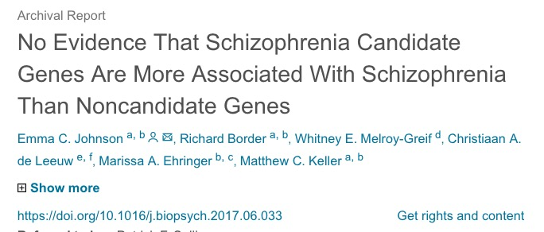

<!-- What's going on? -->
## Today's Topics

- Schizophrenia

## Schizophrenia

<iframe width="420" height="315" src="https://www.youtube.com/embed/gGnl8dqEoPQ" frameborder="0" allowfullscreen></iframe>

## Simulating the Experience

<iframe width="420" height="315" src="https://www.youtube.com/embed/YXimT5CHCDE" frameborder="0" allowfullscreen></iframe>

## Overview

- Lifetime prevalence ~ 0.3-0.7%
    - Broader definitions suggest 2-3 or 3-5%
- ~1/3 chronic & severe
- Onset post-puberty, early adulthood
- Males earlier onset & greater severity
- Pervasive disturbance in mood, thinking, movement, action, memory, perception
- Increased (early) mortality

## "Positive" symptoms

- “Additions” to behavior
- Disordered thought
- Delusions of grandeur, persecution
- Hallucinations (usually auditory)
- Bizarre behavior

## "Negative" symptoms

- “Reductions” in behavior
- Poverty of speech
- Flat affect
- Social withdrawal
- Impaired executive function
- Anhedonia (loss of pleasure)
- Catatonia (reduced movement)

## Cognitive symptoms

- Memory
- Attention
- Planning, decision-making
- Social cognition
- Movement

## Affective dysregulation

- Depressive, manic states

---

[[@Van_Os2009-be]](http://dx.doi.org/10.1016/S0140-6736(09)60995-8)

<!-- Relationships among the 4+ symptom categories -->

---

[[@Van_Os2009-be]](http://dx.doi.org/10.1016/S0140-6736(09)60995-8)

<!-- Symptom profiles of different types of psychosis -->

## Biological bases

- Genetic predisposition
- Brain abnormalities
- Developmental origins

## Genetic disposition

## Heritability

- 80%
- vs. 60% for osteoarthritis
- 30-50% for hypertension [[@Van_Os2009-be]](http://dx.doi.org/10.1016/S0140-6736(09)60995-8)

## But, no single gene...{.smaller}

[[@Johnson2017-bp]](http://doi.org/10.1016/j.biopsych.2017.06.033)

## Genes associated with schizophrenia at higher than chance levels {.smaller}

- *NOTCH4*, *TNF*: 
    - Part of major histocompatibility complex (MHC), cell membrane specializations involved in the immune system
    
- *DRD2* (dopamine D2 receptor), *KCNN3* (Ca+ activated K+ channel), *GRM3* (metabotropic glutamate receptor)

[[@Johnson2017-bp]](http://doi.org/10.1016/j.biopsych.2017.06.033)

## Ventricles larger, esp in males

## Ventricular enlargement increases across time {.smaller}

[[@Kempton2010-ms]](http://doi.org/10.1016/j.schres.2010.03.036)

## Enlargement precedes diagnosis? {.smaller}

As in trajectories B or F

[[@Kempton2010-ms]](http://doi.org/10.1016/j.schres.2010.03.036)

## Hip, amyg, thal, NA smaller

- Related to ventricular enlargement
- Early disturbance in brain development?

---

[[@Van_Erp2015-ne]](http://doi.org/10.1038/mp.2015.63)

## [[@jiao_transmembrane_2017]](10.1073/pnas.1618213114)

- Dentate gyrus (DG) in hippocampus 
    - spatial coding, learning & memory, emotion processing 
- DG dysfunction implicated in schizophrenia
- Gene linked to schizophrenia, Transmembrane protein 108 (Tmem108) enriched in DG granule neurons
- Tmem108 expression increased during postnatal period critical for DG development.

## [[@jiao_transmembrane_2017]](10.1073/pnas.1618213114)

- Tmem108-deficient neurons form fewer and smaller spines. 
- Tmem108-deficient mice display schizophrenia-relevant behavioral deficits.

## Rapid gray matter loss in adolescents? {.smaller}

[[@thompson_mapping_2001]](http://dx.doi.org/10.1073/pnas.201243998)

<!-- Scrolling final reference page -->
<!-- http://stackoverflow.com/q/38260799 -->

## Widespread white matter disruption {.smaller}

[[@Kelly2017-lj]](http://doi.org/10.1038/mp.2017.170)

## White matter loss over age {.smaller}

[[@Kochunov2016-cu]](http://doi.org/10.1002/hbm.23336)

## Dysconnectivity in cortical networks {.smaller}

[[@Uhlhaas2013-do]](http://doi.org/10.1016/j.conb.2012.11.004)

## Inconsistent connectivity findings [[@Fornito2015-go]](http://dx.doi.org/10.1016/j.conb.2014.08.006)

- Structural connectivity vs.
    - Synaptic, dendritic, axonal connections b/w regions
    - Usually measured via DTI or related diffusion-based MRI technique
- Functional connectivity
    - BOLD, EEG, or MEG covariance
    - Task-free 'resting' state or task-based
- Global signal variations?

## [[@Fornito2015-go]](http://dx.doi.org/10.1016/j.conb.2014.08.006)

## Global signal alterations {.smaller}

[[@Yang2014-oq]](http://dx.doi.org/10.1073/pnas.1405289111)

## Dysconnectivity b/w 'hubs' -> higher functional connectivity {.smaller}

<a href="https://doi.org/10.1016/j.conb.2014.08.006">

[[@Fornito2015-go]](http://dx.doi.org/10.1016/j.conb.2014.08.006)
</a>

## Dopamine hypothesis

## Evidence for DA hypothesis

- DA ($D_2$ receptor) antagonists (e.g. chlorpromazine)
    + improve positive symptoms
- *Typical antipsychotics* are DA $D_2$ antagonists
- DA agonists
    + amphetamine, cocaine, L-DOPA
    + mimic or exacerbate symptoms
    
## Evidence against...

- New, *atypical antipsychotics* 
    + (e.g. Clozapine) INCREASE DA in frontal cortex, affect 5-HT
- Mixed evidence for high DA metabolite levels in CSF
- Some DA neurons may release 5-HT, cannabinoids, glutamate [[@Seutin2005-wx]](http://doi.org/http://dx.doi.org/10.1038/sj.bjp.0706328)

## Glutamate/ketamine hypothesis

- *Psychomimetic* drugs induce schizophrenia-like states
    + Phencyclidine (PCP), ketamine
    + NMDA receptor antagonists

## Ketamine

- dissociative (secondary) anesthetic
- side effects include hallucinations, blurred vision, delirium, floating sensations, vivid dreams
- binds to serotonin ($5HT_{2a}$) receptor, $\kappa$ opioid receptor, and $\sigma$ receptor "chaperone"
- may be dopamine $D_2$ receptor antagonist

## Glutamate/ketamine hypothesis

- Schizophrenia == *underactivation* of NMDA receptors?
    - NMDA receptor role in learning, plasticity
    - DG neurons in [[@jiao_transmembrane_2017]](10.1073/pnas.1618213114) were glutamate-releasing.
- NMDAR antagonists -> neurodegeneration, excitotoxicity, & apoptosis

## Schizophrenia summed up

- Wide-ranging disturbance of mood, thought, action, perception
- Broad changes in brain structure, function, chemistry, development
- ~~Dopamine hypothesis~~ giving way to glutamate hypothesis
- Genetic (polygenic = multiple genes) risk + environmental factors

## Early life stress increases risk

- 2x greater odds for children in urban environments
- Higher risk among migrant populations [[@Cantor-Graae2005-ej]](http://dx.doi.org/10.1176/appi.ajp.162.1.12)
- Exposure to infection *in utero*, other birth complications
- Exposure to cannibis
- Paternal age > 40

## [[@levine_transgenerational_2016]](10.1016/j.schres.2016.06.019)

- Children (N=51,233) of parents who born during Nazi era (1922-1945)
- Emigrated before (indirect exposure) or after (direct exposure) to Nazi era
- Children exposed to direct stress of Nazi era *in utero* or postnatally
    + Did **not** differ in rates of schizophrenia, but
    + Had higher rehospitalization rates
    
## [[@debost_investigating_2015]](http://doi.org/10.1016/j.psyneuen.2015.05.013)

- Danish cohort (n=1,141,447)
- Exposure to early life stress 
    + *in utero* did **not** increase risk of schizophrenia, but
    + during 0-2 years increased risk
- Increased risk associated with an allele of a cortisol-related gene

## The future: Outcomes following hospitalization

[[@Van_Os2009-be]](http://dx.doi.org/10.1016/S0140-6736(09)60995-8)

<!-- Less than 50% positive; less than 50% negative; Mixed and non-systematic. -->

## The future of psychiatric research

- The [Research Domain Criteria (RDoC) Project](https://www.nimh.nih.gov/research-priorities/rdoc/index.shtml) 
    - Negative valence, positive valence, cognitive systems, social processes, arousal/regulatory systems
    
## The future of psychiatric research

- [U.K. Biobank](https://www.ukbiobank.ac.uk/)
- [Enhancing Neuro Imaging Genetics through Meta Analysis (ENIGMA) Consortium](http://enigma.ini.usc.edu/)

## Next time...

- Affective disorders

## References {.smaller}