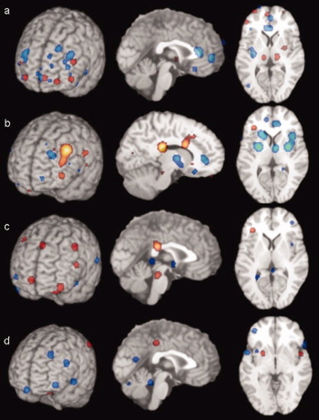

## Today's topic(s)

- Depression
- Planning for student-led presentations

## Depression

- Symptoms
    + Unhappy mood, insomnia, lethargy, loss of pleasure, interest, energy
- Agitation
- Lasting for several weeks or more

## Depression

- Experienced by ~7% Americans in any year
- Prevalence (up to ~20% lifetime)
- Females 2-3x males, higher 40+ years of age
    - postpartum anxiety and depression in 10-20% of mothers
- MZ concordance ~60% vs. DZ ~20% suggests genetic component

## Symptoms, [[@mahar_stress_2014]](http://doi.org/10.1016/j.neubiorev.2013.11.009)

## Neurobiology of Major Depressive Disorder (MDD)

- Reduced sizes of brain regions
- Hypoactivity
- Pharmacological factors
- Synaptic neurotrophic dysfunction

## Neurological factors

- Reduced hippocampal volumes
- [[@Videbech2004-sm]](http://ajp.psychiatryonline.org/doi/abs/10.1176/appi.ajp.161.11.1957) meta-analysis

## [[@Videbech2004-sm]](http://ajp.psychiatryonline.org/doi/abs/10.1176/appi.ajp.161.11.1957)

Left Hippocampus

## [[@videbech2004hippocampal]](http://dx.doi.org/10.1176/appi.ajp.161.11.1957)

Right Hippocampus

---

[[@Palazidou2012-je]](http://dx.doi.org/10.1093/bmb/lds004)

<!-- Areas of the brain whose sizes are altered in depression -->

## Hypoactivity in

+ Frontal and temporal cortex
+ Anterior cingulate
+ Insula
+ Cerebellum
- [[@fitzgerald_meta-analytic_2008]](http://dx.doi.org/10.1002/hbm.20426)

## [[@fitzgerald_meta-analytic_2008]](http://dx.doi.org/10.1002/hbm.20426) {.smaller}

[a] patients v. ctrls, [b] patients on SSRIs, [c] patients v. ctrls (happy stim), [d] patients v. controls (sad stim)

## Baseline hyperactivity [[@Hamilton2012-iv]](https://doi.org/10.1176/appi.ajp.2012.11071105)

## Valence-specific hyperactivity [[@Hamilton2012-iv]](https://doi.org/10.1176/appi.ajp.2012.11071105)

## Increased connectivity between resting state network regions and dorsal PFC [[@Sheline2010-nh]](http://doi.org/10.1073/pnas.1000446107) {.smaller}

CCN (yellow); precuneus, part of DMN (pink); and affective division of the ACC (turquoise)

## Altered connectivity
[[@cheng_medial_2016]](http://doi.org/10.1093/brain/aww255)

- Resting state fMRI (rsFMRI) in 421 patients with major depressive disorder and 488 control subjects.
- Reduced connectivity between orbitofrontal cortex (OFC) and other areas of the brain
- Increased connectivity between lateral PFC and other brain areas

----

----

---

[[@Palazidou2012-je]](http://dx.doi.org/10.1093/bmb/lds004)

<!-- Summary of brain areas implicated in depression -->

## Pharmacological factors

- Endocrine
    + Thyroid dysfunction [[@Medici2014-pn]](http://dx.doi.org/10.1210/jc.2013-3589)
    + Altered cortisol reactivity [[@Burke2005-ya]](http://dx.doi.org/10.1016/j.psyneuen.2005.02.010)
    
## Pharmacological factors

- Monoamine hypothesis
    + More: euphoria
    + Less: depression
    + Resperine (antagonist for NE & 5-HT) can cause depression
    + Low serotonin (5-HT) metabolite levels in CSF of suicidal depressives [[@samuelsson_csf_2006]](http://dx.doi.org/10.1111/j.1600-0447.2005.00639.x)
    
## Measuring 5-HT

- CSF, platelets, plasma, urine, saliva
- CSF & platelets correlate highly [[@Audhya2012-sv]](http://dx.doi.org/10.1016/j.bbagen.2012.05.012)
- Salivary 5-HT does not correlate with mood symptoms [[@Leung2018-ks]](http://dx.doi.org/10.1016/j.ymgmr.2018.03.008)

---

[[@Palazidou2012-je]](http://dx.doi.org/10.1093/bmb/lds004)

<!-- Neurochemical and hormonal alterations in depression -->
    
## Drug treatments

- Monoamine oxidase (MAO) inhibitors
    + MAO inactivates monoamines in terminal buttons
    + MAO-I’s boost monoamine levels
- Tricyclics
    + Inhibit NE, 5-HT reuptake
    + Upregulate monoamine levels, but non-selective = side effects
    
## Drug treatments

- Selective Serotonin Reuptake Inhibitors (SSRIs)
    + Fluoxetine (Prozac, Paxil, Zoloft)
    + Prolong duration 5-HT in synaptic cleft
    + Also increase brain steroid production
- Serotonin/Norepinephrine Reuptake Inhibitors (SNRIs)

## Cymbalta (SNRI)

<iframe width="420" height="315" src="https://www.youtube.com/embed/OTZvnAF7UsA" frameborder="0" allowfullscreen></iframe>

## How well do drugs work?

- [STAR*D trial](http://www.nimh.nih.gov/funding/clinical-research/practical/stard/allmedicationlevels.shtml)
- On SSRI for 12-14 weeks. ~1/3 achieved remission; 10-15% showed symptom reduction.
- If SSRI didn't work, could switch drugs. ~25% became symptom free.
- 16% of participants dropped out due to tolerability issues
- Took 6-7 weeks to show response.

## Who benefits from drug therapy?

- Depends on
    + Early life stress
    + Brain (amygdala) response to emotional faces [[@goldstein-piekarski_human_2016]](http://doi.org/10.1073/pnas.1606671113)
- Low-stress + low amyg reactivity -> > responding
- High stress + high amyg reactivity -> > responding

----

[[@goldstein-piekarski_human_2016]](http://doi.org/10.1073/pnas.1606671113)

## Problems with monoamine hypothesis

- Too simplistic
- NE, 5-HT interact
- Drugs fast acting (min), but improvement slow (weeks)
- "No correlation between serotonin and its metabolite 5-HIAA in the cerebrospinal fluid and [11C]AZ10419369 binding measured with PET in healthy volunteers". [[@Tiger2015-dy]](http://hdl.handle.net/10616/44513)

---

> "*...we performed the first meta-analysis of the mood effects in ATD and APTD studies. The depletion of monoamine systems (both 5-HT and NE/DA) does not decrease mood in healthy controls. However, in healthy controls with a family history of MDD the results suggest that mood is slightly decreased...by [monoamine depletion]...*"

[[@Ruhe2007-qc]](http://dx.doi.org/10.1038/sj.mp.4001949)

## What do drugs do, then?

## Ketamine again

- Relieves depressive symptoms relatively quickly [[@Berman2000-vg]](https://www.ncbi.nlm.nih.gov/pubmed/10686270) and [[@Zarate2006-np]](http://dx.doi.org/10.1001/archpsyc.63.8.856)
- Boosts synaptic spine formation [[@Li2010-ve]](http://dx.doi.org/10.1126/science.1190287) and reverses effects of induced stress

## Pathway of pathology [[@Duman2012-md]](http://dx.doi.org/10.1126/science.1222939)

- Depression ~ chronic stress [[@mahar_stress_2014]](http://doi.org/10.1016/j.neubiorev.2013.11.009)
- Stress -> chronic HPA axis activity
- Chronic HPA activity -> neuronal atrophy in hipp & PFC
- Stress & cortisol decrease expression of brain-derived neurotrophic factor (BDNF)
- BDNF boosts neurogenesis
- SSRIs act via BDNF, as do NMDA receptor antagonists (e.g., ketamine)

## [[@Duman2012-nz]](http://dx.doi.org/10.1016/j.tins.2011.11.004)

## [[@Frohlich2014-tq]](http://dx.doi.org/10.1177/0269881113512909)

## Electroconvulsive Therapy (ECT)

- Last line of treatment for drug-resistant depression
- Electric current delivered to the brain causes 30-60s seizure.
- ECT usually done in a hospital's operating or recovery room  under general anesthesia.
- Once every 2 - 5 days for a total of 6 - 12 sessions.

## Electroconvulsive Therapy (ECT)

- Remission rates of up to 50.9% [[@dierckx_efficacy_2012]](http://doi.org/10.1111/j.1399-5618.2012.00997.x)
- Seems to work via
    + Anticonvulsant (block Na+ channel or enhance GABA function) effects
    + Neurotrophic (stimulates neurogenesis) effects

## Putting the pieces together

[[@Palazidou2012-je]](http://dx.doi.org/10.1093/bmb/lds004)

## The disordered mind: Take home messages

- Multi-level, multi-method, multi-variate approaches essential to understanding mental illness
- Developmental processes across the life span
- Networks all the way down...

<!-- Scrolling final reference page -->
<!-- http://stackoverflow.com/q/38260799 -->

## References {.smaller}
