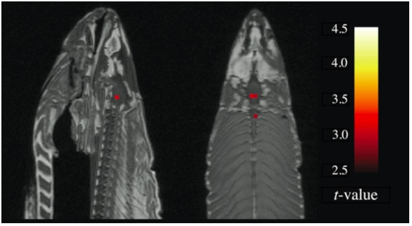
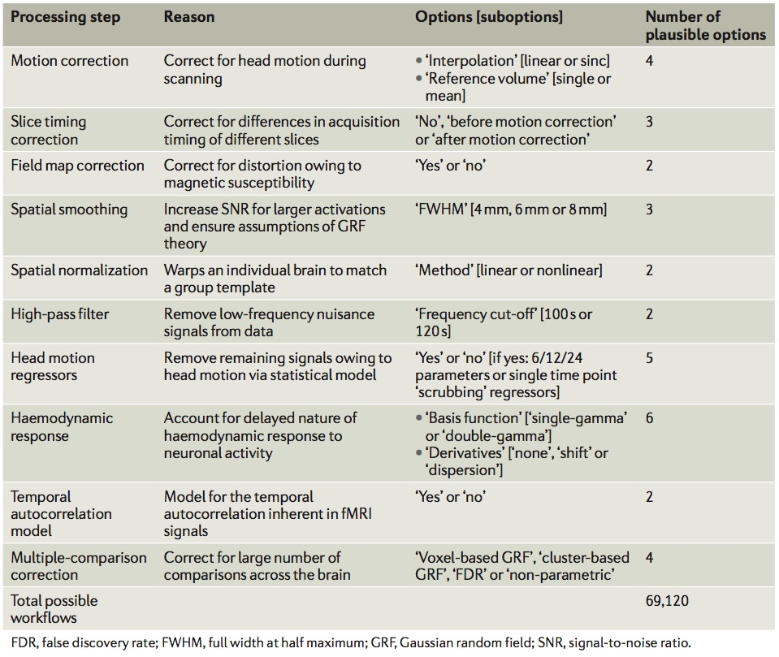
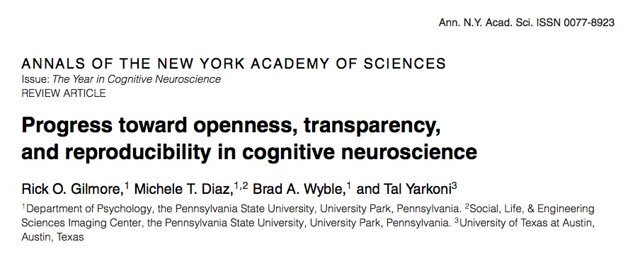
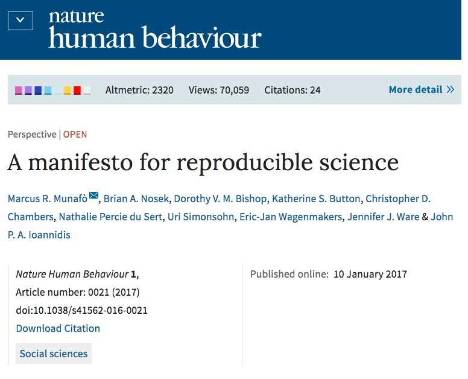
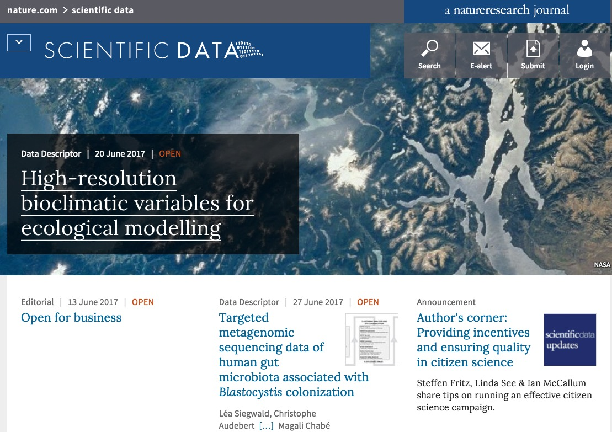
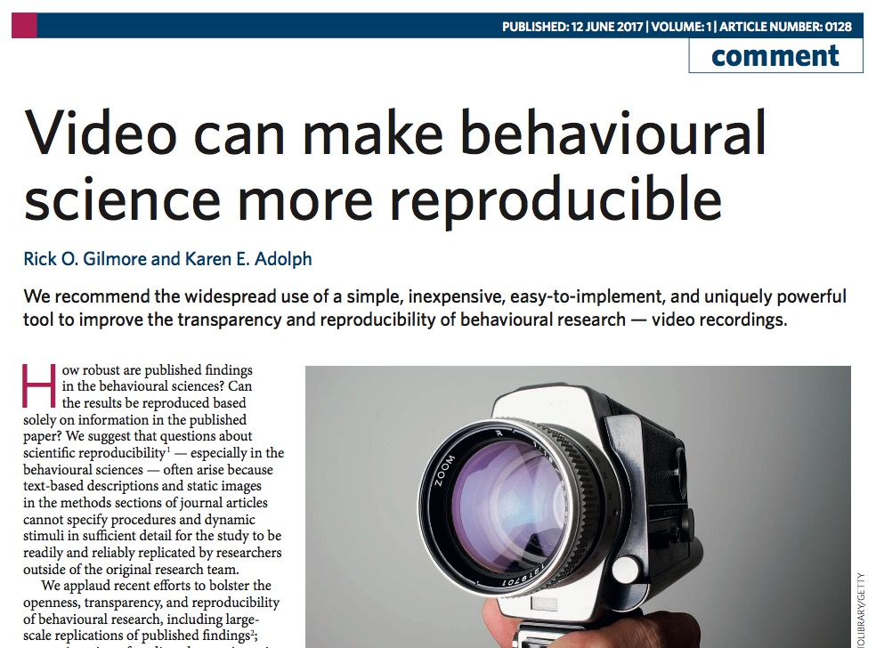
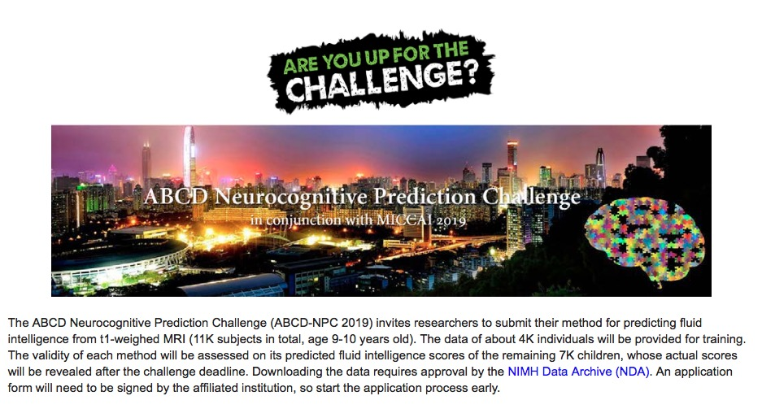
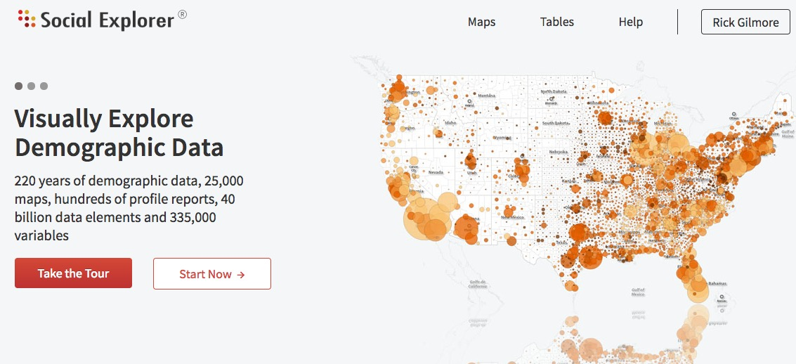

<!-- For more info about appearance and style parameters: -->
<!-- http://rmarkdown.rstudio.com/revealjs_presentation_format.html#appearance_and_style -->

```{r setup, include=FALSE}
knitr::opts_chunk$set(echo = FALSE)
```

## Today's topics

- Reproducibility in neuroscience

---

<iframe width="560" height="315" src="https://www.youtube.com/embed/66oNv_DJuPc" frameborder="0" allowfullscreen></iframe>

<https://www.youtube.com/embed/66oNv_DJuPc>

## Is there a reproducibility crisis?

- Yes, a significant crisis.
- Yes, a slight crisis.
- No, there is no crisis.
- Don't know.

<div class="notes">
Could I see a show of hands from those who say there is a significant reproducibility crisis? A 'slight' crisis? No crisis? Don't know.
</div>

---

<div class="centered">
<a href="http://www.nature.com/polopoly_fs/7.36716.1469695923!/image/reproducibility-graphic-online1.jpeg_gen/derivatives/landscape_630/reproducibility-graphic-online1.jpeg" height=450px>

</a>

[[@baker_1500_2016]](http://doi.org/10.1038/533452a)
</div>

<div class="notes">
Here are the results from a survey published last year in Nature.
</div>

## Have you ever failed to reproduce an experiment?

- Someone else's
- My own

---

<div class="centered">
<a href="http://www.nature.com/polopoly_fs/7.36718.1464174471!/image/reproducibility-graphic-online3.jpg_gen/derivatives/landscape_630/reproducibility-graphic-online3.jpg">

</a>

[[@baker_1500_2016]](http://doi.org/10.1038/533452a)
</div>

## Have you ever tried to publish a reproduction attempt?

- Published
- Failed to publish

---

<div class="centered">
<a href="http://www.nature.com/polopoly_fs/7.36718.1464174471!/image/reproducibility-graphic-online3.jpg_gen/derivatives/landscape_630/reproducibility-graphic-online3.jpg">

</a>

[[@baker_1500_2016]](http://doi.org/10.1038/533452a)
</div>

## What factors contribute to irreproducible research?

<div class="notes">
Now it's your turn. What factors contribute to irreproducible research?
</div>

---

<div class="centered">
<a href="http://www.nature.com/polopoly_fs/7.36719.1464174488!/image/reproducibility-graphic-online4.jpg_gen/derivatives/landscape_630/reproducibility-graphic-online4.jpg">

</a>

[[@baker_1500_2016]](http://doi.org/10.1038/533452a)
</div>

<div class="notes">
Here are the data from the Nature survey.
</div>

---

- Selective reporting
- *Pressure to publish*
- Low power
- Replication in original labs
- Mentoring/oversight
- Methods, code, data unavailable
- Poor design

---

- Fraud
- Insufficient peer review
- Variability of reagents
- *Bad luck*

<div class="notes">
I suggest that **most** of these are problems we can solve.
</div>

---

<div class="centered">

</div>

---

<div class="centered">
<a href="https://www.amazon.com/Rigor-Mortis-Science-Worthless-Billions/dp/0465097901">
</a>
</div>

# Reproducibility in Psychology

## Psychology is harder than physics

---

<div class="centered">

</div>

---

<div class="centered">

</div>

## Behavior has multiple, nested dimensions {.smaller}

<div class="centered">
<video width="600" height="400" controls>
  <source src="https://nyu.databrary.org/slot/27087/0,372193/asset/119877/download?inline=true" type="video/mp4">
Your browser does not support the video tag.
</video>
</div>

<small>Adolph, K., Tamis-LeMonda, C. & Gilmore, R.O. (2017). PLAY Project: Pilot Data Collections. Databrary. Retrieved November 16, 2018 from https://nyu.databrary.org/volume/444#panel-data
</small>

## Data are sensitive, hard(er) to share

- Protect participant's identities
- Protect from harm/embarrassment

## Sampling is biased

- Much (lab-based) data collected are from **W**estern, **E**ducated **I**ndustrialized, **R**ich, **D**emocratic (WEIRD) populations [[@henrich_weirdest_2010]](http://doi.org/10.1017/S0140525X0999152X)

## Even on [Mechanical Turk](http://www.behind-the-enemy-lines.com/2015/04/demographics-of-mechanical-turk-now.html)

<div class="centered">

</div>

----

<div class="centered">


See also: <http://demographics.mturk-tracker.com/>
</div>

---

<div class="centered">
<a href="http://press.princeton.edu/titles/10970.html">

</a>
</div>

## The sin of unreliability

- Direct replications rare, discouraged, hard to publish
- Critical methodological details go unreported

## Studies are underpowered {.smaller}

<div class="centered">


<small>[Szucs & Ioannides, 2017](http://doi.org/10.1371/journal.pbio.2000797)</small>
</div>

---

<div class="centered">
> "*Assuming a realistic range of prior probabilities for null hypotheses, false report probability is likely to exceed 50% for the whole literature.*"

<small>[Szucs & Ioannides, 2017](http://doi.org/10.1371/journal.pbio.2000797)</small>
</div>

## The sin of data hoarding

- Data sharing is **not** universal practice
- Even **after** a publication has gone to press
- Despite implicit agreement to do so if publishing in certain journals (e.g., American Psychological Association)

---

<div class="centered">


[[@wicherts_poor_2006]](http://doi.org/10.1037/0003-066X.61.7.726)
</div>

## & hasn't improved since 2006 {.smaller}

<div class="centered">
```{r vanpaemel-et-al-data, echo=FALSE, warning=FALSE, message=FALSE}
# http://collabra.org/articles/10.1525/collabra.13/download/table/T1?type=csv
sharing.dat <- read.csv(file = "csv/10.1525-collabra.13_T1.csv")
library(ggplot2)
library(dplyr)
sharing.dat %>% 
  ggplot() + 
  geom_col(mapping = aes(x=Journal, 
                         y=Proportion, 
                         fill=Response))
```

[[@vanpaemel_are_2015]](http://doi.org/10.1525/collabra.13)
</div>

## The sin of corruptibility

<div class="centered">
<a href="http://science.sciencemag.org/content/348/6239/1100.2">

</a>

[[@lacour_when_2014]](http://doi.org/10.1126/science.1256151)
</div>

---

<div class="centered">
<a href="http://pubman.mpdl.mpg.de/pubman/item/escidoc:1569964:8/component/escidoc:1569966/Stapel_Investigation_Final_report.pdf">

</a>
</div>

---

- Stapel was Dean of the School of Social and Behavioral Sciences at Tilburg University, teacher of Scientific Ethics course
- Fraud investigation launched when 3 grad students noticed anomalies -- duplicate entries in data tables
- Stapel confessed, lost position, gave up Ph.D., wrote a book

## Self-reported data fabrication, falsification, and alteration {.smaller}

<div class="centered">
<a href="http://journals.plos.org/plosone/article?id=10.1371/journal.pone.0005738">

</a>

[[@fanelli_how_2009]](https://doi.org/10.1371/journal.pone.0005738)
</div>

## Self-reports of questionable research practices {.smaller}

<div class="centered">
<a href="http://journals.plos.org/plosone/article?id=10.1371/journal.pone.0005738">

</a>

[[@fanelli_how_2009]](https://doi.org/10.1371/journal.pone.0005738)
</div>

---

<div class="centered">
<a href="http://www.sciencemag.org/news/2012/09/harvard-psychology-researcher-committed-fraud-us-investigation-concludes">

</a>
</div>

--- 

- Marc Hauser
- Evolutionary/Comparative Psychologist, Professor at Harvard
- Resigned 2011 after internal investigation found him responsible for research misconduct
- Details see [2012 report by NIH Office of Research Integrity (ORI)](https://grants.nih.gov/grants/guide/notice-files/NOT-OD-12-149.html) and [Hauser's response](http://archive.boston.com/whitecoatnotes/2012/09/05/marc-hauser-responds-federal-finding-scientific-misconduct/spzRWEVIPKA4BUu8wi8t8J/story.html). 

## Mistakes, e.g., flexible "stopping" rules {.smaller}

<div class="centered">
<a href="">

</a>

[[@simmons_false-positive_2011]](http://doi.org/10.1177/0956797611417632)
</div>

## Errors/omissions in data

- C. Reinhart and K. Rogoff paper, <http://www.nber.org/papers/w15639.pdf?new_window=1>
    - Omitted data in Excel spreadsheet used to model effect of public debt on economic growth. <https://www.bloomberg.com/news/articles/2013-04-18/faq-reinhart-rogoff-and-the-excel-error-that-changed-history>
    - Error only found **when data were shared**.
    
## The sin of bias...

>*"This article reports 9 experiments, involving more than 1,000 participants, that test for retroactive influence by "time-reversing" well-established psychological effects so that the individual's responses are obtained before the putatively causal stimulus events occur."*

[[@Bem2011-kl]](10.1037/a0021524)

<div class="notes">
And this 2011 paper by Daryl Bem from Cornell purporting to show evidence for Extrasensory Perception or precognition. Psychology is harder than physics, but it doesn't supercede it. This paper as blogger Tal Yarkoni [notes](http://www.talyarkoni.org/blog/2011/01/10/the-psychology-of-parapsychology-or-why-good-researchers-publishing-good-articles-in-good-journals-can-still-get-it-totally-wrong/) shows the perils of using standard, but flawed research practices. 
</div>

---

>*"We argue that in order to convince a skeptical audience of a controversial claim, one needs to conduct strictly confirmatory studies and analyze the results with statistical tests that are conservative rather than liberal. We conclude that Bem's p values do not indicate evidence in favor of precognition; instead, they indicate that experimental psychologists need to change the way they conduct their experiments and analyze their data."*

[[@Wagenmakers2011-yh]](http://doi.org/10.1037/a0022790)

## Reproducibility "Crisis"

- [Reproducibility Project: Psychology](https://osf.io/ezcuj/)
- Attempt to replicate 100 experimental and correlational studies published in three psychology journals in 2008 using high-powered designs and original materials when available. 
- Materials, data, protocols, analysis code shared via the [Open Science Framework (OSF)](http://osf.io) from the [Center for Open Science (COS)](http://cos.io)

## Results published in [[@collaboration_estimating_2015]](http://doi.org/10.1126/science.aac4716)

- 39/98 (39.7%) replication attempts were successful
- 97% of original studies reported statistically significant results vs. 36% of replications

---

<div class="centered">


[[@collaboration_estimating_2015]](http://doi.org/10.1126/science.aac4716)
</div>

## So, did the studies replicate? 

- Samples not equal
    + Sampling error differences predicts < 100% reproducibility
- Protocols not identical
    + Only 69% of original PIs "endorsed" replication protocol. Replication rate 4x higher (59.7% vs. 15.4%) in studies with endorsed protocol.
- [[@collaboration_estimating_2015]](http://doi.org/10.1126/science.aac4716) *"...seriously underestimated reproducibility of psychological science."*

## [Camerer et al. 2018](http://doi.org/10.1038/s41562-018-0399-z)

- High-powered (90% power to detect effects smaller than original) replications of $n=$21 studies published in *Science* and *Nature* between 2010-2015
- Phase I 90% power to detect $0.75d_{orig}$; Phase II 90% power to detect $0.5d_{orig}$

---

- "*...replication sample sizes in stage 1 were about three times as large as the original sample sizes and replication sample sizes in stage 2 were about six times as large as the original sample sizes.*"
- "*...replication and analysis plans were made publicly known on the project website, pre-registered at the Open Science Framework (OSF) and sent to the original authors for feedback and verification prior to data collecion...*"

---

```{r, fig.cap="Camerer et al. Fig 1", out.width="100%"}
knitr::include_graphics("img/camerer-2018-fig-1.jpg")
```

---

```{r, fig.cap="Camerer et al. Fig 2", out.width="100%"}
knitr::include_graphics("img/camerer-2018-fig-2.jpg")
```

## Summary

- significant effect in same direction for 13 (62%) studies
- effect size ~50% of the original
- replicability between 12 (57%) and 14 (67%) from complementary replicability indicators
- estimated true-positive rate is 67% in a Bayesian analysis
- prediction market valuations corresponded to 'success' of replication efforts

## What do we mean by 'reproducibility'?

[Goodman et al., 2016](http://doi.org/10.1126/scitranslmed.aaf5027)

## *Inferential* reproducibility
    
- Same inferences from one or more studies or reanalyses

<small>[Goodman et al., 2016](http://doi.org/10.1126/scitranslmed.aaf5027)</small>

## *Results* reproducibility

- Same results from independent study

<small>[Goodman et al., 2016](http://doi.org/10.1126/scitranslmed.aaf5027)</small>

## *Methods* reproducibility
    
- Enough details about materials & methods recorded (& reported)
- Same results with same materials & methods

<small>[Goodman et al., 2016](http://doi.org/10.1126/scitranslmed.aaf5027)</small>

---


---

> "*...psychologists tend to treat other peoples’ theories like toothbrushes; no self-respecting individual wants to use anyone else’s.*"

<small>[Mischel, 2009](https://www.psychologicalscience.org/observer/becoming-a-cumulative-science)</small>

---

> "*The toothbrush culture undermines the building of a genuinely cumulative science, encouraging more parallel play and solo game playing, rather than building on each other’s directly relevant best work.*"

<small>[Mischel, 2009](https://www.psychologicalscience.org/observer/becoming-a-cumulative-science)</small>

---


<!-- (Inferred) mental states vs. (Observable) behaviors. Restoring behavior to psychology alongside internal mental (and neural) states -->

## What do we measure, what do we infer?

- Behaviors
- Brain/physiological states
- Thought processes, feelings, opinions, ...

# Special problems in neuroscience

---

<div class="centered">


<small>[Szucs & Ioannides, 2017](http://doi.org/10.1371/journal.pbio.2000797)</small>
</div>

## Risks of false positives in neuroscience

<div class="centered">
<a href="http://prefrontal.org/files/posters/Bennett-Salmon-2009.pdf">

</a>

</div>

## Multiple (> 69K) computational pathways

<div class="centered">
<a href="http://dx.doi.org/10.1038/nrn.2016.167">

</a>

[[@Poldrack2017-xc]](http://doi.org/10.1038/nrn.2016.167)
</div>

---

<div class="centered">

</div>

---

<div class="centered">


[[@Gilmore2017-qi]](http://doi.org/10.1111/nyas.13325)
</div>

# Toward a better future

## Tools for openness and transparency

- [Open Science Framework (OSF)](https://osf.io/)
    - Reproducibility Project
    - Pre-registration Challenges
    - Pre-print services
    
## Changing journal, funder practices

- [Transparency and opennness promotion (TOP) guidelines](https://osf.io/9f6gx/), [[@nosek_promoting_2015]](http://doi.org/10.1126/science.aab2374)

---

- Data, materials, code citation
- Data transparency
- Analytic methods (code) transparency
- Design and analysis transparency
- Preregistration of studies
- Preregistration of analysis plans
- Replication

---

<div class="centered">


[[@munafo_manifesto_2017]](http://doi.org/10.1038/s41562-016-0021)
</div>

---

<div class="centered">
<a href="http://www.nature.com/articles/s41562-016-0021/figures/1">

</a>

[[@munafo_manifesto_2017]](http://doi.org/10.1038/s41562-016-0021)
</div>

## Large-scale replication efforts

<div class="centered">


["Many Labs" Replication Project](https://osf.io/wx7ck/)
</div>

## Improving methodology training

- [Literate Programming](http://www.literateprogramming.com/)
    - [RStudio](http://rstudio.com) and [R Markdown](http://rmarkdown.rstudio.com/)
    - [Jupyter](http://jupyter.org) notebooks
    - Electronic lab notebooks, talks, reports, articles...
- [Software Carpentry](https://software-carpentry.org/)
- Version control (e.g., [GitHub](http://github.com))
- [PSY 511 Spring 2017](http://psu-psychology.github.io/psy-511-reproducible-research-spring-2017/)
- [R Bootcamp](http://psu-psychology.github.io/r-bootcamp-2018/)

## Data publication

- [Inter-university Consortium for Political and Social Research (ICPSR)](http://www.icpsr.umich.edu)
- [Dataverse](http://dataverse.org)
- [Dryad Data Repository](http://datadryad.org)

---

<div class="centered">
<a href="https://www.nature.com/sdata/">

</a>
</div>

## [OpenNeuro.org](http://openneuro.org)

<div class="centered">
<a href="http://openneuro.org">

</a>
</div>

---

<iframe src="http://databrary.org">
</iframe>

## [Databrary.org](http://databrary.org)

- Specializes in storing, sharing video
- Video captures behavior unlike other methods, but is *identifiable*
- Policy framework for sharing identifiable data
    + **Permission to share** -> builds on informed consent
    + **Restricted access** for (institutionally) authorized researchers
- **Datavyu**, free, open-source video coding tool
    
---

<div class="centered">


[[@GilmoreAdolph2017]](http://doi.org/10.1038/s41562-017-0128)
</div>

## [Neurosynth.org](http://neurosynth.org)

<div class="centered">
<video width="720" height="450" controls>
  <source src="mov/neurosynth-happy.mp4" type="video/mp4">
Your browser does not support the video tag.
</video>
</div>

---

<div class="centered">

</div>

---

<div class="centered">

</div>

## [Social Data Explorer](http://www.socialexplorer.com/)

<div class="centered">
<a href="http://www.socialexplorer.com/">
<div class="centered">

</div>
</a>
</div>

## [Allen Brain Atlas](http://www.brain-map.org/)

<div class="centered">

</div>

## A vision of our open science future...

- All data, materials, code shared
    + when paper goes to press or at end of grant period
- Shared in repositories that encourage data linkage (w/ permission)
    + People, places, times, tasks, behaviors, ...
 
---

<div class="centered">

</div>

---

<div class="centered">
<a href="http://bids.neuroimaging.io">

</a>

bids.neuroimaging.io
</div>

---

- Commonplace citations of data, materials, code, findings
- Ecosystems for new discovery

---

<div class="centered">


[[@Gorgolewski2016-fd]](http://doi.org/10.1371/journal.pbio.1002506)
</div>

---

<div class="centered">

</div>

---

<div class="centered">

</div>

## Your thoughts?

## Stack

This talk was produced on `r Sys.Date()` in [RStudio](http://rstudio.com) version `r rstudioapi::versionInfo()$version` using R Markdown.
Information about the R Session that produced the code is as follows:

```{r session-info}
sessionInfo()
```

<!-- Scrolling final reference page -->
<!-- http://stackoverflow.com/q/38260799 -->
<style>
slides > slide { overflow: scroll; }
slides > slide:not(.nobackground):before {
  background: none;
  }
slides > slide:not(.nobackground):after {
  content: '';
  background: none;
  }
}
</style>

## References {.smaller}
