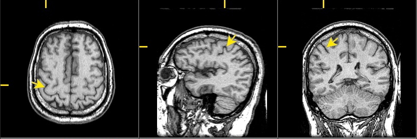
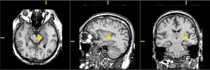

<div class="centered">
Answer the questions in the spaces provided on the question sheets.
If you run out of room for an answer, continue on the back of the page.
Please take no more than 30 min to complete this quiz, and please do not use use any resources other than your own memory.

# Describe the main components of the central nervous system associated with the lateral ventricles.

# What region of the brain is associated with the cerebral aqueduct?

# What parts of the brain are associated with the 4th ventricle?

# Label the planes of section illustrated in each of the three panels in the figure below:

```{r, echo=FALSE, out.width='100%', fig.align='center'}

```

\newpage

# The arrow in the figure above points to a major sulcus on the lateral surface of the cerebral cortex, the [........], which divides the [........] from the parietal lobes.

# Primary [........] cortex is located on the \emph{anterior} bank of this sulcus in the [........] lobe.

# Primary [........] cortex is located on the \emph{posterior} bank of this sulcus in the [........] lobe.

# In each of the panels in the figure, label as many of the following directional terms as you are able to use: anterior/posterior; superior/inferior; medial/lateral; dorsal/ventral. 
# The [........] is a forebrain structure that controls ingestion, defense, and reproductive behavior. It is also the means by which the CNS controls both the [........] system via the pituitary gland and the [........] nervous system.

# The [........] is a forebrain structure located deep within the (medial/lateral) portions of the [........] lobe. It captures and stores behaviorally relevant information about specific places and locations.

# Diffusion tensor imaging (DTI) is an example of a brain imaging technique with [........] temporal resolution. DTI provides information about [........].

# Functional MRI (fMRI) is considered an \emph{indirect} measure of neuronal activity because...

\newpage

# Describe at least two ways that neurons differ from other cells in the body.

# (BONUS) [......] are the type of glial cell found in the PNS; [........] are found in the CNS.

# (BONUS) The arrows in the figure below point to the [........], a structure early anatomists thought looked like a seahorse.

```{r, echo=FALSE, out.width='100%', fig.align='center'}

```

