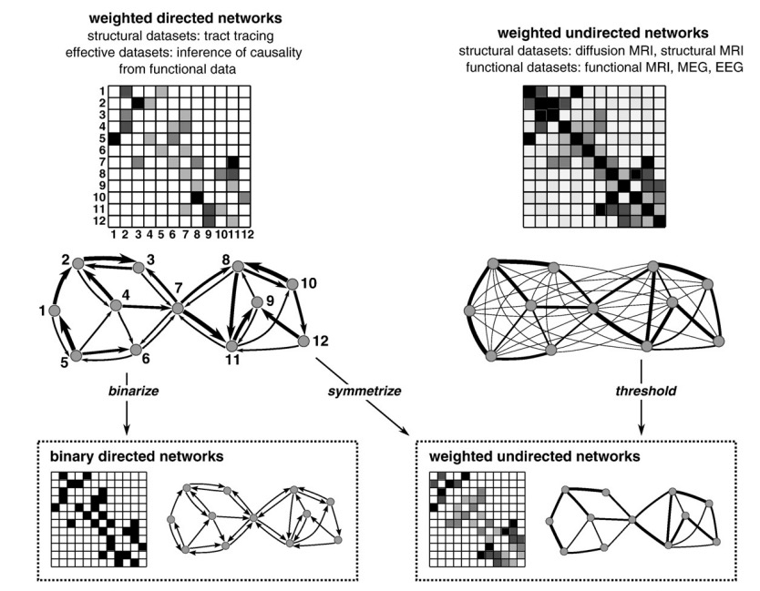
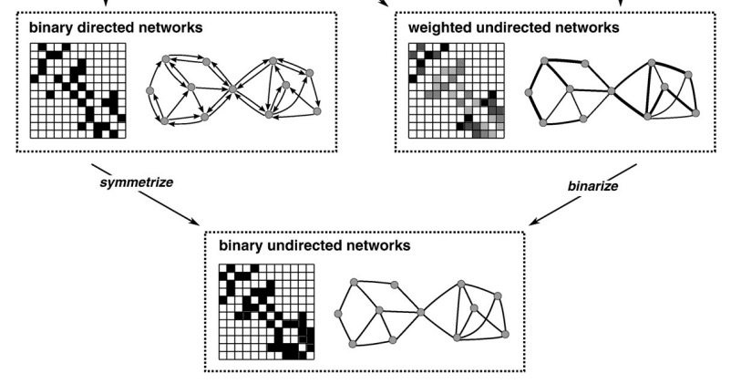
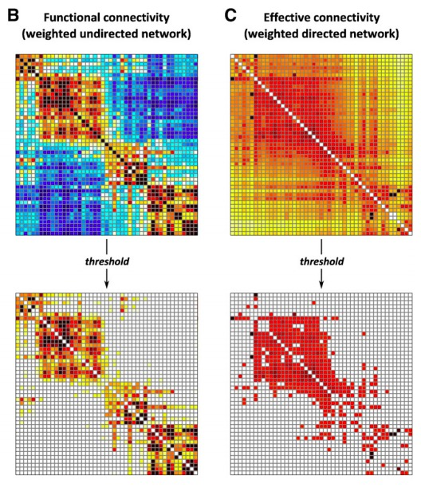
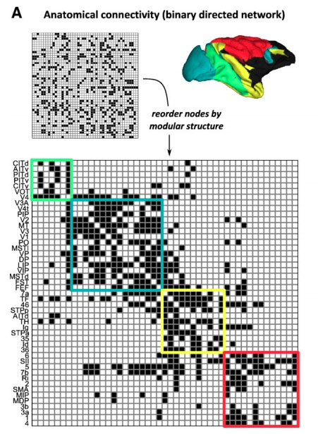
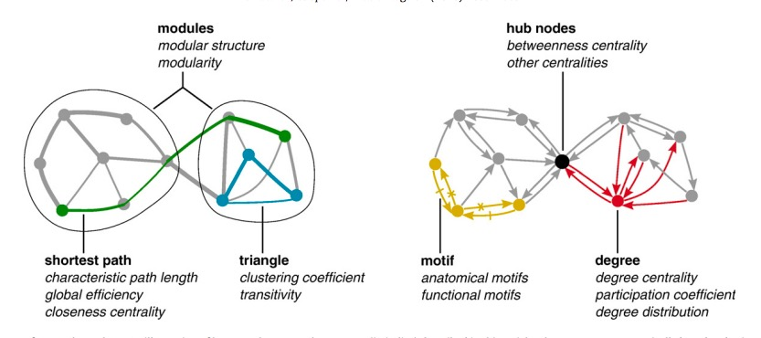
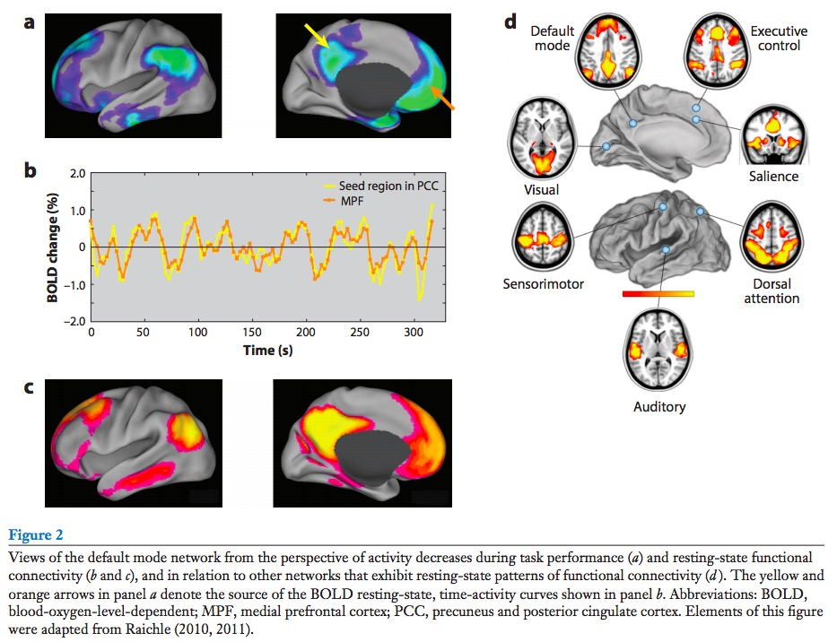

## Today's Topics

- Networks
- Planning for student-led sessions

## But first...

- Short answers means short sentences.
- Be complete. Show me that you know what you're talking about.

---

Resting potential ~ -70 mV

| Ion | [inside] | [outside] | Conc Gradient | Equil potential | Driving force | Electrostatic gradient |
|-----|-----------|--------------|-------------|-----|-----|----|
| $K^+$  | ~150 mM | ~4 mM  | outward | ~-90 mV | +20 mV | outward |
| $Na^+$ | ~10 mM | ~140 mM | inward | ~+55 mV | -125 mV | inward |

## Components

- Nodes
- Edges

## Measures of

- Size
- Density
- Degree (# of edges)
- Centrality
- Motifs
- Path length

---

[[@Stiso2018-mf]](http://doi.org/10.1016/j.tics.2018.09.007)

## Types

- Directed vs. undirected
- Weighted vs. binarized
- Structural (wiring), functional (activity covariance), effective (causal)

---

[[@Rubinov2010-mc]](http://dx.doi.org/10.1016/j.neuroimage.2009.10.003)

---

[[@Rubinov2010-mc]](http://dx.doi.org/10.1016/j.neuroimage.2009.10.003)

---

[[@Rubinov2010-mc]](http://dx.doi.org/10.1016/j.neuroimage.2009.10.003)

---

[[@Rubinov2010-mc]](http://dx.doi.org/10.1016/j.neuroimage.2009.10.003)

---

[[@Rubinov2010-mc]](http://dx.doi.org/10.1016/j.neuroimage.2009.10.003)

---

<iframe width="560" height="315" src="https://www.youtube.com/embed/nvXuq9jRWKE" frameborder="0" allow="accelerometer; autoplay; encrypted-media; gyroscope; picture-in-picture" allowfullscreen></iframe>

---

[[@Swanson2016-qr]](http://dx.doi.org/10.1146/annurev-neuro-071714-033954)

## Temporal (speed) vs. spatial (wiring) constraints

[[@Stiso2018-mf]](http://doi.org/10.1016/j.tics.2018.09.007)

## Some networks in the "resting" brain

[[@Raichle2015-fg]](http://dx.doi.org/10.1146/annurev-neuro-071013-014030)

---

[[@Sejnowski2014-aa]](http://doi.org/10.1038/nn.3839)

---

<!-- Gene expression networks in schizophrenia -->

---

<!-- Convolutional neural networks in computer vision -->

---

<!-- Interpersonal and interorganizational -->

---

## Prepping for student presentations

| Group Theme | Members | Presentation Day? |
|-------------|---------|-------------------|
| Measuring brain & behavior | Kelley, Anna, Alison, Lauren, Rhea | |
| Neurodegeneration & disorder | Kaitlin, Sam, Daryl, Emily | |
| Development, aging, & plasticity | Liz, Michael, Lia, Chloe | |
| Cognition & emotion | Austen, Brandon, Shane, Natalia | |

Not assigned: Natalia, Nate

## Scope of group presentations

- Provide 2-3 background readings in advance
- 25 min (max) presentation + 10 min discussion
- Focused themes + integrative section
    - What have we learned/what do we know?
    - What don't we know?
    - Why are these answers important to know?
    - How does topic X relate to/inform another theme?
- Submit slides
    - Statement about who did what

## References {.smaller}
